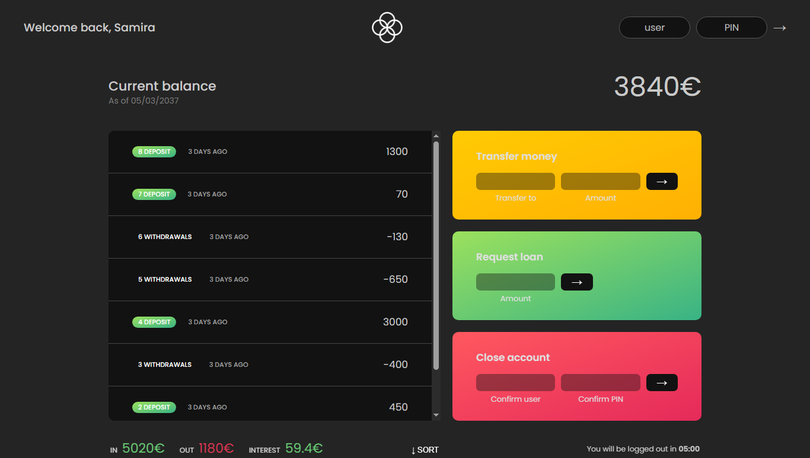

# **Bankist App**  

## 📸 Bankist App Preview


A modern banking UI that allows users to log in, transfer money, request loans, and close accounts. Built with **JavaScript** for interactive UI elements and **DOM manipulation**.  

## **🚀 Features**  
✅ **User Authentication** – Login with predefined credentials.  
✅ **Transfers & Loans** – Send money and request loans with simple inputs.  
✅ **Account Closure** – Users can delete their accounts securely.  
✅ **Sorted Transactions** – Display transactions in ascending/descending order.  
✅ **Auto Logout** – Session expires after inactivity.  
✅ **Smooth Animations** – UI elements transition seamlessly.  

## **🛠 Technologies Used**  
- **JavaScript (ES6+)**  
- **HTML, CSS**  
- **DOM Manipulation**  
- **Event Handling**  

## **📸 Screenshots**  
*(Add screenshots of the app here if available.)*  

## **🚀 How to Use?**  
1. Open the app: [Bankist Live Demo](https://smircodes.github.io/Bankist/)  
2. Log in with one of these credentials:  
   - **User 1:** `sr` | **PIN:** `1111`  
   - **User 2:** `js` | **PIN:** `2222` 
   - **User 3:** `st` | **PIN:** `3333`  
   - **User 4:** `ss` | **PIN:** `4444` 

3. Try transferring money, requesting loans, or closing an account.  

## **📂 Project Structure**  
```
/Bankist-App
│── index.html       # Main UI
│── style.css        # Styling
│── script.js        # App logic
│── README.md        # Documentation
```

## **📜 License**  
This project is for educational purposes only.  
